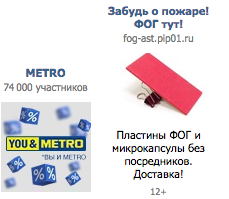
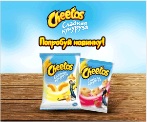

# 9. Motion design

Моушн-дизайн  — направление деятельности Студии, затрагивающее разработку баннеров, видеопрезентаций, анимаций, встраиваемых в сайт.

## Баннер

Рекламный формат, встраиваемый в сайт. Может быть статичным изображением, текстом, содержать анимированные элементы (видео и интерактивные объекты). Как правило, содержит гиперссылку на сайт рекламодателя или страницу с дополнительной информацией.

### Форматы баннеров

        - **Текстовый** — вид рекламы, при котором рекламное текстовое сообщение интегрируется на  веб-страницу с сохранением основной стилистики и выглядит как ее составная часть. Пользователи поисковой системы могут осознанно игнорировать графические баннеры, но при этом проявляют интерес к тексту
        - **Текстово-графический**  — формат, соединяющий изображение и рекламный текст, к которому предъявляются отдельные требования (например, количество символов)

        
        - **Статичный** — изображение в формате JPG, GIF или PNG, в котором отсутствует смена кадров или анимация
        
        
        - Анимированный баннер — рекламный формат, содержащий анимированные элементы, реализованные в различной среде разработки (HTML-код, SWF, GIF)

        

        

        
        - Флеш-баннер (SWF) — анимированный формат, технически реализованный в программе Adobe Flash Animate или Adobe Animate CC. Для просмотра требует установки дополнительного flash плагина. Осенью 2015 года популярный браузер Google Chrome отказался от поддержки этого формата в пользу HTML-анимации
        - Swiffy — баннер в формате HTML, изначально созданный в формате SWF и сконвертированный в последствии в программный код с помощью ресурса Swiffy
    - Видео-баннер  — формат, как правило, встраиваемый в плееры популярных видеосервисов (Youtube, Vimeo)
    - Нестандартый баннер — формат, выходящий за рамки стандартной области размещения:
        - 3D-баннер  — 3D-анимация трёх изображений, сменяющих друг друга на одной площадке;
        - FullScreen — полноэкранный баннер в виде swiffy-креатива , 
        flash-креатива или изображения;
        - Screenglide/Expandable — интерактивный баннер, расхлопывающийся в зависимости от действий пользователя (клик, наведение и т. д. ), в рамках которого воспроизводится видео;
        - SideKick — при наведении курсора на баннер происходит расхлоп 
        до большего баннера и сдвигается контент сайта;
        - Rich-media  — обычный баннер, появляющийся сразу после загрузки страницы поверх контента, при скроллинге находится на экране;
        - BottomLine — нижняя перетяжка, при скроллинге не изменяет своего положения и расхлопывается по наведению курсора мыши

        Более подробный список нестандартных форматов и их описание:
        https://specs.adfox.ru/
        http://www.adriver.ru/doc/ban/
          
### Технические требования площадок

Каждый интернет-ресурс имеет список требований и технических условий, под которые нужно оформить все рекламные материалы, передаваемые на площадку.

Для лучшего понимания, следует изучить ТТ популярных ресурсов:

- Яндекс
- Mail.ru
- Google
- Рамблер
### Этапы разработки
1. **Идея / Креатив** — суть рекламной задачи, визуальный образ будущего баннера, схема взаимодействия между форматами
2. **Скетч** — идея баннера в виде наброска ключевых элементов и описания анимационных взаимодействий между кадрами 

    

3. **Раскадровка баннера** — последовательность ключевых кадров и отрисовка всех необходимых для анимации элементов. К работе над баннером подключаются иллюстратор и дизайнер: они готовят все материалы при участии моушн-дизайнера , который консультирует, как именно нужно обработать материалы для последующей анимации
4. **Уникальный баннер** — этап создания анимации и интерактива из отрисованных ранее материалов
5. **Утверждение** уникального баннера с клиентом
6. **Изучение медиаплана** — каждая медийная рекламная кампания имеет заранее известный список площадок, для размещения на которых готовятся ресайзы в соответствии с техническими требованиями (ТТ) площадок.
7. **Подготовка ресайзов** — изменение формата / размера / ТТ исходного баннера под каждую площадку
8. **Внесение правок / утверждение тиража** — проверка каждого формата на соответствие макету и исходной раскадровке, орфографические и прочие ошибки. Для проверки привлекается ответственный менеджер.
